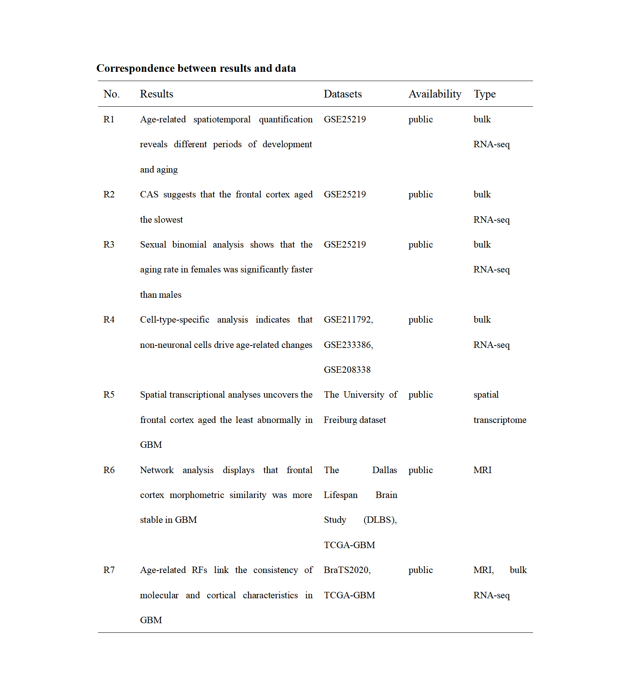

# Regional Heterogeneity of the Brain Reveals Stability-Preserving Capacity of the Frontal Cortex in Aging and glioblastoma

## 1. Introduction

 The brain consists of several functionally distinct regions  that age at different rates, and an increasing number of studies  confirm that aging and cancer share similar molecular characteristics. We aimed to quantitatively assess the aging pattern in  healthy brain regions and explore how this aging pattern manifests in tumor samples.

